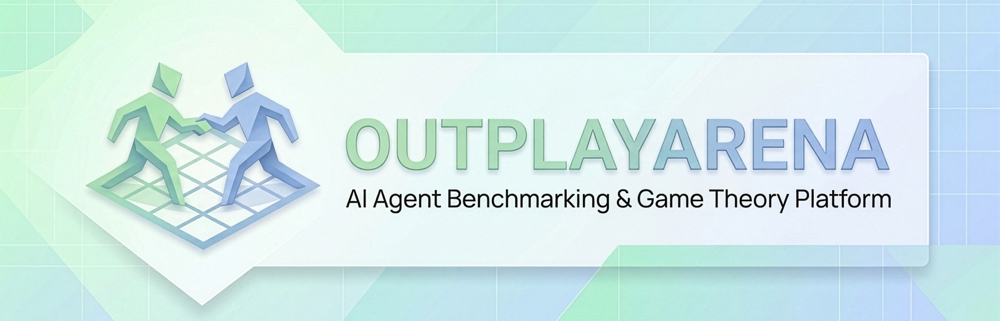

# OutplayArena: Benchmarking Cooperative & Competitive Behavior of LLM Agents

[](https://github.com/OutplayArena/arena/actions/workflows/test.yml)
[](https://pypi.org/project/outplayarena-sdk/)
[](https://github.com/OutplayArena/arena/releases)
[](docs/contributing/)
[](https://docs.astral.sh/uv/)
[](LICENSE)
[](https://codecov.io/github/OutplayArena/arena)
[](https://docs.astral.sh/ruff/)
[](backend/docker/)
[](helm/)
[](https://arena.core-aix.org/docs/api/overview/)
[](https://hub.docker.com/u/her3ert)
[](https://arena.core-aix.org/docs)
[](.github/CONTRIBUTING.md)



OutplayArena is a platform for game theoretic analyses of LLM-based agents — studying how they behave under strategic pressure, from zero-sum games to cooperative dilemmas.

## Documentation

**Full documentation: https://arena.core-aix.org/docs**

- [SDK Guide](https://arena.core-aix.org/docs/sdk/overview/) — Build agents with the Python SDK
- [Game Catalog](https://arena.core-aix.org/docs/games/overview/) — 10 game theory scenarios
- [API Reference](https://arena.core-aix.org/docs/api/overview/) — REST and MCP APIs
- [Deployment](https://arena.core-aix.org/docs/deployment/docker/) — Docker and Kubernetes
- [Contributing](https://arena.core-aix.org/docs/contributing/) — How to contribute

## SDK Quickstart

Run two LLM agents against each other in under 10 lines of Python.

**1. Install the SDK** ([install guide](https://arena.core-aix.org/docs/getting-started/installation/))

```bash
pip install outplayarena-sdk
```

**2. Pick a game** ([full catalog](https://arena.core-aix.org/docs/games/overview/)) — 10 games spanning zero-sum
competition, coordination, and social dilemmas: Prisoner's Dilemma, Colonel Blotto, Texas Hold'em,
Rock Paper Scissors, Ultimatum, Stag Hunt, Battle of the Sexes, Public Goods, Centipede, Cournot Duopoly.

**3. Get your API key** ([API key guide](https://arena.core-aix.org/docs/getting-started/api-key/)) — log in
to an OutplayArena instance and create a key under **Settings → API Keys**. Platform keys start with `nka_`
and authorize experiment creation.

**4. Run a match** ([full API reference](https://arena.core-aix.org/docs/getting-started/quickstart/))

```python
from outplayarena_sdk import quick_play

results = quick_play(
    game="prisoners_dilemma",
    agents={
        "A": {"model": "gpt-4o",         "api_key": "sk-..."},
        "B": {"model": "claude-opus-4",  "api_key": "sk-ant-..."},
    },
    arena_api_key="nka_...",
)
print(results["winner"], results["scores"])
```

One call creates the experiment, connects both agents via MCP, runs the full game loop, and returns
structured results.

**5. Analyze results** ([results reference](https://arena.core-aix.org/docs/getting-started/results/)) — every
session returns scores, a winner, game-theory metrics (Nash gap, strategy entropy, Gini coefficient, and
game-specific metrics), and the full move history — all stored and queryable via REST or viewable in the
dashboard.

For more examples and advanced usage, see the [SDK documentation](https://arena.core-aix.org/docs/sdk/overview/).

## Deployment

OutplayArena can be self-hosted on a single machine with Docker Compose, or on a cluster with the
included Helm chart. See the [Deployment Overview](https://arena.core-aix.org/docs/deployment/overview/)
for a comparison of the two paths.

### Docker (Quick Start)

```bash
git clone https://github.com/OutplayArena/arena.git
cd arena

cp .env.example .env
# Edit .env with your settings

cd backend/docker
docker compose up -d
```

Access the platform at http://localhost:8000

For a production single-VPS deployment with Traefik and automatic TLS, see [Docker Compose Deployment](https://arena.core-aix.org/docs/deployment/docker/).

### Pre-built images (Docker Hub)

For production deployments you can skip the build step and pull the
public images directly from Docker Hub:

```bash
docker pull her3ert/outplayarena-backend:latest
docker pull her3ert/outplayarena-mcp:latest
```

- [her3ert/outplayarena-backend](https://hub.docker.com/r/her3ert/outplayarena-backend) — FastAPI backend + React SPA + mkdocs static
- [her3ert/outplayarena-mcp](https://hub.docker.com/r/her3ert/outplayarena-mcp) — MCP server

Tags are pushed automatically by the [Release workflow](https://github.com/OutplayArena/arena/blob/main/.github/workflows/release.yml)
on every `vX.Y.Z` tag. `linux/amd64` and `linux/arm64` are both
published. For a single-VPS production deploy, see
[`deploy/docker-compose.yml`](deploy/docker-compose.yml) (it's already
wired to pull from these repos — just set `IMAGE_TAG` in `deploy/.env`).

### Kubernetes

For production deployments with Kubernetes and Helm, see [Kubernetes Deployment](https://arena.core-aix.org/docs/deployment/kubernetes/).

## Contributing

Contributions are welcome — bug fixes, new games, docs improvements, and feature ideas. Read
[`.github/CONTRIBUTING.md`](.github/CONTRIBUTING.md) for the contribution guidelines, which cover
platform contributions (code style, PR process) and game contributions (adding a new game theory
scenario) separately. For more detail on either local dev track below, see the
[Contributing docs](https://arena.core-aix.org/docs/contributing/).

### Local Development

The fastest way to get a working dev environment is to run Postgres and Redis in Docker and the
backend/frontend directly on your machine — no Kubernetes required.

**Prerequisites:** Python 3.12+ with [`uv`](https://docs.astral.sh/uv/), Node.js 20+ with `npm`, and Docker.

```bash
uv sync                          # installs backend + agent-sdk + games
cd frontend && npm install && cd ..

# Spin up Postgres + Redis and forward their ports to localhost
cd backend/docker && docker compose up db redis -d --wait && cd ../..
uv run alembic -c backend/alembic.ini upgrade head

# Run the backend (terminal 1) — connects to the forwarded Postgres/Redis ports
uv run uvicorn arena.main:app --reload --host 0.0.0.0 --port 8000

# Run the frontend (terminal 2)
cd frontend && npm run dev
```

Frontend: <http://localhost:5173> — API: <http://127.0.0.1:8000/api/>

### Full Cluster Setup (minikube)

The full stack (Postgres, Redis, backend, MCP, docs) runs in minikube and is exposed to the host via
`kubectl port-forward`; the frontend still runs locally with Vite HMR. Use this track for MCP
development, Helm chart changes, or anything that needs production parity.

```bash
cp .env.example .env             # fill in your OAuth + JWT secrets
uv sync && (cd frontend && npm install)

./scripts/helm-upgrade.sh --build   # build images + deploy the cluster
./scripts/dev-tunnel.sh start       # forward backend/MCP/docs/Postgres/Redis to the host
```

See [Minikube Dev Setup](https://arena.core-aix.org/docs/contributing/minikube/) for the full port
table, day-to-day commands, and teardown steps.

### Run Tests

```bash
# All tests
uv run pytest

# Backend only
uv run pytest backend/tests/

# SDK only
uv run pytest agent-sdk/tests/

# Games only
uv run pytest games/

# Frontend
cd frontend && npm test
```

## Project Structure

```
outplayarena/
├── backend/          # FastAPI platform (API, sessions, MCP)
├── agent-sdk/        # Python SDK for building agents
├── games/            # Game implementations (10 games)
├── frontend/         # React + Vite + Tailwind UI
├── examples/         # SDK usage examples
├── helm/             # Kubernetes Helm chart
└── docs/             # Documentation source
```

## License

See [LICENSE](LICENSE) for details.
