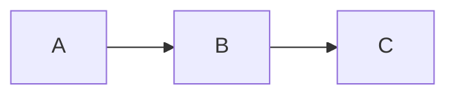

# Docs Development

The documentation site is built with [MkDocs Material](https://squidfunk.github.io/mkdocs-material/). This page covers how to preview and edit docs locally.

## Setup

```bash
# Install docs dependencies
pip install -r docs/requirements.txt
```

Or with uv:

```bash
uv pip install -r docs/requirements.txt
```

## Preview Locally

```bash
mkdocs serve
```

The site is available at `http://localhost:8000`. Changes to Markdown files and `mkdocs.yml` reload automatically.

## File Structure

```
docs/
├── index.md                    # Home page
├── getting-started/            # Getting Started section
├── games/
│   ├── overview.md             # Games section index
│   └── catalog/                # One page per game
├── mcp/                        # MCP section
├── sdk/
│   ├── overview.md             # SDK Reference section index
│   └── howto/                  # How-to guides
├── api/                        # API Reference
├── deployment/                 # Self-Hosting section
├── contributing/               # Contributing sub-pages
├── blog/                       # Blog posts
├── stylesheets/extra.css       # Custom CSS
└── overrides/                  # Theme overrides
```

## Navigation

The navigation is defined in `mkdocs.yml` under the `nav:` key. To add a new page:

1. Create the Markdown file in the appropriate directory
2. Add it to `mkdocs.yml` under the correct section

Example:

```yaml
nav:
  - Games:
      - games/overview.md
      - My New Game: games/catalog/my_game.md   # add here
```

## Markdown Features

The docs use [Material for MkDocs](https://squidfunk.github.io/mkdocs-material/) with several extensions enabled. Key features:

**Tabbed content:**
```markdown
=== "Tab A"
    Content for tab A.

=== "Tab B"
    Content for tab B.
```

**Admonitions:**
```markdown
!!! note
    This is a note.

!!! warning
    This is a warning.

!!! tip
    This is a tip.
```

**Code blocks with titles:**
````markdown
```python title="example.py"
print("hello")
```
````

**Task lists:**
```markdown
- [x] Done
- [ ] Not done
```

**Mermaid diagrams:**
````markdown

````

## Auto-Generated API Reference

The SDK API reference (`docs/sdk/api-reference.md`) is auto-generated from Python docstrings using `mkdocstrings`. Run `mkdocs serve` to generate it — it reads from `agent-sdk/src/`.

## Game Documentation Auto-generation

The per-game catalog pages are partially auto-generated from game YAML files. If you've added a new game (see [Adding Games](adding-games.md)), regenerate the base page:

```bash
python scripts/build_game_docs.py
```

Then add the "What Is This Game?", "How to Play", and API/UI side-by-side sections manually.

## Build for Production

```bash
mkdocs build --strict
```

`--strict` fails on warnings, including broken links and missing pages in the nav. Run this before submitting a docs PR.

## Deployment

Documentation is served by the backend at `/docs/`. In production Docker Compose and Kubernetes deployments, it's built into the `her3ert/outplayarena-backend` image. The docs rebuild automatically when a new release is tagged.

In development with Vite, requests to `/docs/*` are proxied to the `docs` service (port 8080 in minikube, or `mkdocs serve` at 8000 in Docker Compose dev mode).
